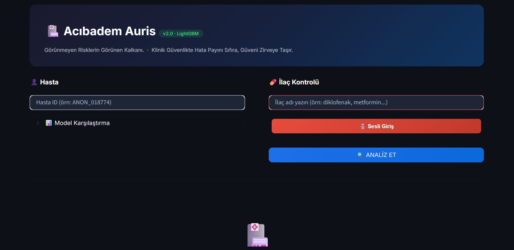

# 🩺 Acıbadem Auris: Uncovering Hidden Clinical Risks

**ACUHIT 2026 Hackathon**

Auris is a real-time **Clinical Decision Support System (CDSS)** triggered during drug prescription. It scans a patient's lab history, chronic diseases, and current medications in milliseconds to prevent medication errors. The system is statistically validated on over **71 Million** real patient records.

## ⚖️ Hybrid Decision Engine & Risk Scoring
Auris calculates a precise risk score using a unique hybrid architecture: **Rule-Based (50%) + LightGBM (30%) + NLP (20%)**.
* 🔴 **High Risk (0-30):** Contraindication detected. The system provides an audio alert and suggests a safe alternative drug.
* 🟡 **Medium Risk (31-55):** Requires close monitoring.
* 🟢 **Safe (56-100):** Safe to prescribe.

## 🌟 Core Features
* 🎙️ **Voice Integration:** Hands-free clinical usage with **Web Speech API** for both voice input (tr-TR) and automated audio output.
* 🧬 **NLP Agent:** Powered by **Nexpath API (asa-mini)** to explain pharmacological mechanisms with clinical evidence levels (FDA/EMA/ESC/NICE).
* 📊 **Pharmacovigilance Analysis:** Retrospective PRE/POST cohort analysis using the **Wilcoxon Signed-Rank** test to statistically prove drug impacts (e.g., NSAID effect on Creatinine).
* 🧠 **Explainable AI:** Uses **SHAP** for transparent predictions. Top risk factors identified: *GFR, Age, Active Drug Count, HbA1c, Last Creatinine*.

## ⚙️ Data & ML Pipeline (Sentinel Engine)
* **Big Data Processing:** Fast querying of 5.8M patients and 71M+ lab records using **DuckDB**. Engineered 45 distinct features.
* **Model Selection:** Evaluated 4 models with 5-fold CV. **LightGBM** was selected (AUC-ROC: 0.9664, F1: 0.8964). SMOTE was applied for class imbalance.
* **Clinical Rules:** Integrated 26 clinical rules across 12 drug groups (NSAIDs, Metformin, ACE Inhibitors, etc.).

## 💻 Tech Stack
* **Database:** DuckDB
* **Machine Learning:** LightGBM, scikit-learn, imbalanced-learn, SHAP
* **NLP & UI:** Nexpath API, Streamlit
* **Stats & Voice:** SciPy, Web Speech API (Chrome)
## 📄 License
This project is licensed under the Apache License 2.0. See the `LICENSE` file for details.

